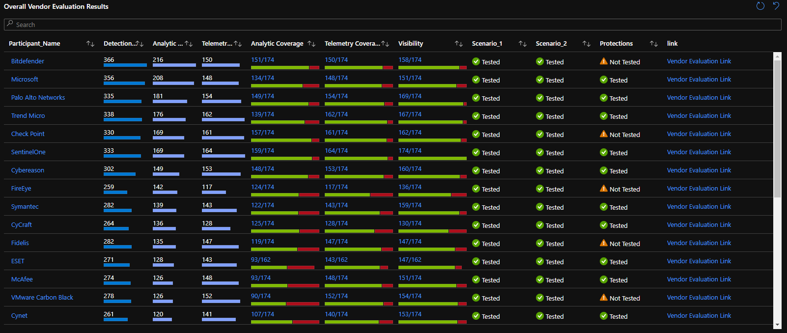
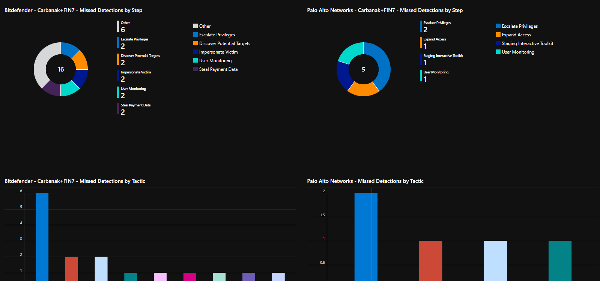

# Mitre Evaluation Azure Workbook

This workbook was created to analyze the latest Mitre 2020 evaluation and help organizations understand how participants did. 
You can use this workbook to help analyze the MITRE ATT&CK participant evaluations. There are tabs on top that will take you to specific evaluations and a comparison tool.

**Features**
- Overall score summary
- Missed Detections
- Participant Comparison tool

**Pre-requisites**
- Azure subscription

## How to install

**Video Guide**

You can copy the workbook code and paste into the advanced editor or you can click deploy to Azure to deploy the workbook

## Screenshots

Overall Result Summary

Comparison Chart

